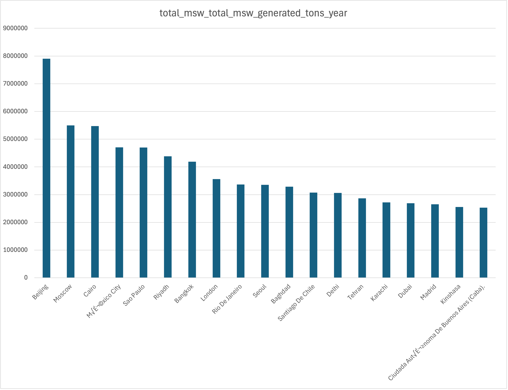

# Global Urban Waste Management

## About
This repository was created for English 105 at the University of North Carolina at Chapel Hill. It contains a dataset of global city-level waste management statistics, a processed subset focused on diversion rates, and the Python notebook used to analyze and visualize the data.

The purpose of this project is to examine how waste is generated and managed across different countries and cities, and to highlight the effectiveness of diversion methods like recycling and composting.

## What's in this repository?

###  data/
-  `city_level_data_0_0 (1).csv` – Original raw dataset of global solid waste statistics
-  `all_city_waste.csv` – Cleaned and processed dataset
-  `World_cities_wastes.ipynb` – Python notebook for cleaning, analyzing, and documenting

###  images/
-  `Picture1.png` – Excel visualization of waste generation by city

###  README.md – Project overview and usage instructions

## Data Provenance
The dataset originates from the [World Bank Group](https://datacatalog.worldbank.org/search/dataset/0039596), specifically the *What a Waste* global database.  
It includes city-level information on:
- Annual MSW generation (tons/year),
- Waste composition,
- Treatment and disposal methods,
- Environmental impacts.

The data was downloaded, cleaned, and formatted for analysis. No values were modified beyond standard cleaning (e.g., fixing column names, removing null entries).

## Why this data?
This dataset helps visualize which cities and countries are generating the most waste and which are doing the best job at diverting it from landfills.

It could be useful to:
- Environmental policy analysts
- Sustainability researchers
- Urban planners and city officials
- Curious individuals interested in global waste management trends

## Key Findings
- Countries with the highest total waste output
- Cities with the best and worst diversion rates
- Top 10 waste-generating cities globally

## How to Use
Open the `World_cities_wastes.ipynb` notebook in Google Colab or Jupyter Notebook to walk through the full analysis.

To export subsets of the data, the `.to_csv()` method was used to save new files for reuse and sharing.

## What's Next
This project can be expanded by:
- Exploring waste treatment types by region
- Comparing diversion rates to population or income levels
- Mapping diversion performance visually by geography

## Visualizing the Data
Here is an image showing waste generation by city:

